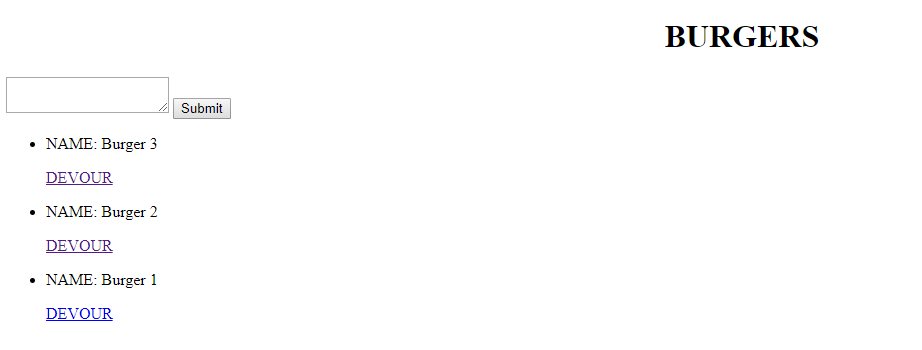
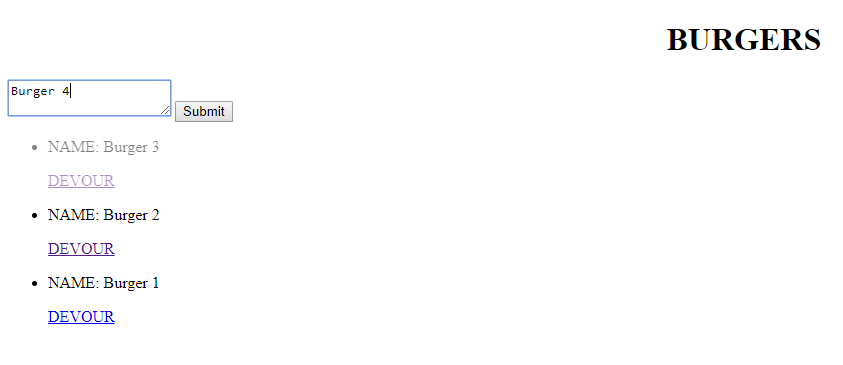
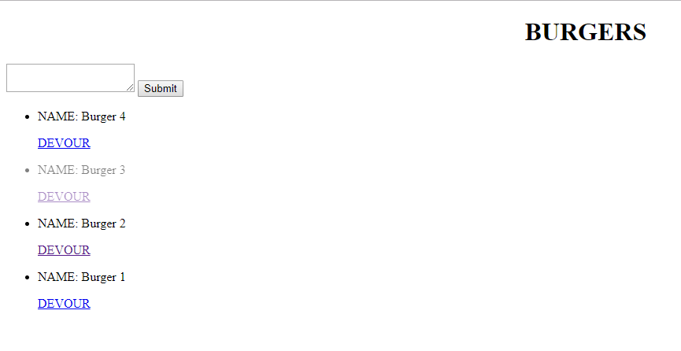

# Burger
Burger logger app using MySQL, Node, Express, Handlebars and a homemade ORM. This app to follows the MVC design pattern and uses Node and MySQL to query and route data in your app, and Handlebars to generate your HTML.

This app allows it's users to add food items  saved inside the local MYSQL database.
Upon entry to Burgers a user is shown a list of all the available items for purchase as shown below.

#
User can enter more items that they would like to add to the menu as below:

#
After user hits the submit button, record will be added to the database and all the entries will be rendered again as below:

